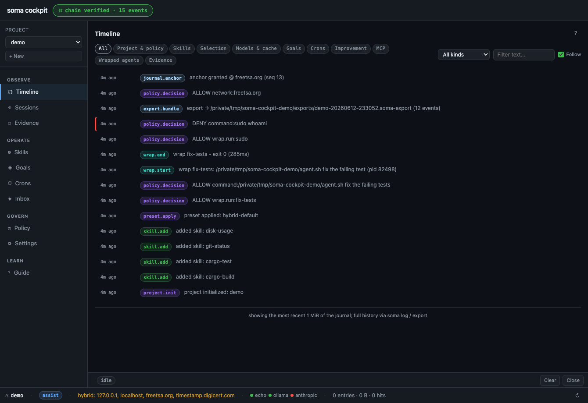
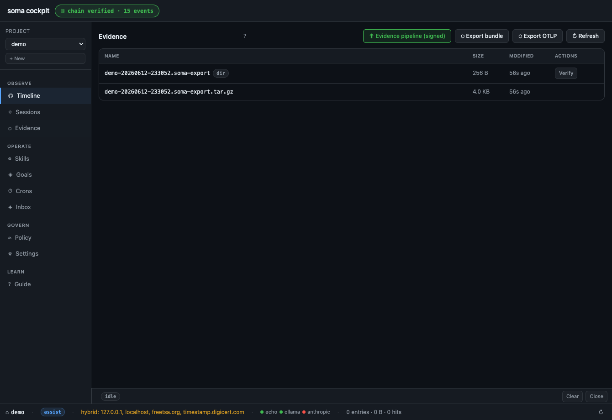

# soma cockpit: a local-first desktop app for AI agent governance and audit

soma cockpit is a desktop app that turns a soma project into a readable evidence cockpit. It is the window onto everything a governed AI agent did: the timeline of journaled actions, the evidence bundles and RFC 3161 anchors that make the record tamper-evident, the wrapped agent sessions, and the policy that decides what an agent is allowed to do. It runs on your machine, reads your project's files directly, and makes no network calls.

If you are an enterprise software architect or part of a team adopting AI agents, the cockpit is where you observe, operate, and govern those agents without trusting a vendor cloud. It pairs with the [soma runtime](https://github.com/radotsvetkov/soma), which is the enforcer that gates and records every action.

## See it



The timeline shows every action a governed agent took, in order. The green badge at the top is the live output of `soma log verify`, not a JavaScript reimplementation. In this run you can read the wrapped agent session (`wrap.start` and `wrap.end`, exit 0 in 285ms), the chain head anchored at freetsa.org, the evidence bundle that was exported, and a `sudo` command that policy denied before it could run, flagged in red.



The evidence view lists exported bundles and anchors, each with a verify action that runs the real check through the runtime. This is the screen you point at when a client, a security team, or an auditor asks what your agents actually did.

## What the cockpit is, and what it is not

The cockpit is a viewer and a control surface. It is not the thing that enforces policy, and it is not a chat app where you talk to a model.

The soma runtime is the enforcer. Every change the cockpit requests is spawned as a soma subprocess, policy-gated there, and journaled there. The cockpit can only ever trigger what the soma command line could trigger, and everything it does lands in the same tamper-evident audit trail. That separation is deliberate: a compromised cockpit is no more dangerous than a hostile operator typing at the CLI, because the runtime is the trust boundary, not the UI.

This means the green "chain verified" badge in the header is never a re-implementation in JavaScript. It is the literal output of `soma log verify`, run through the binary. Claims come from the runtime. Pixels may come from the files.

## Why a desktop app

- Local-first. The cockpit reads a soma project on disk and shells out to the soma binary. There is no server, no account, no tenant, and no telemetry. The content security policy is locked down, and there are no outbound fetches.
- Read-mostly by design. Most of the app is observation. The few actions it can take all route through the runtime's allowlist, so nothing escapes the policy gate or the journal.
- Tamper-evident, end to end. The runtime keeps a hash-chained journal and can anchor it to an independent RFC 3161 timestamp authority. The cockpit shows you that state and lets you verify it, rather than asking you to take its word for it.
- Built for sign-off. If a security team, a client, an auditor, or the EU AI Act needs a record of what your agents did, the cockpit is where you read it and where you export the evidence.

## What you can do in it

The app is organized around three jobs: observe, operate, govern.

Observe:

- Timeline. A live view of the journal as it grows, with each event inspectable. The trust badge re-verifies the whole chain on change, including in-place edits that do not grow the file, so tampering shows up immediately.
- Sessions. The wrapped agent runs in this project, with their evidence shown verbatim. When you govern an agent CLI under soma, this is where you watch what it did.
- Evidence. A browser for the project's exports directory: the evidence bundles, the archives, and the anchored proofs. You inspect bundles and check anchors here rather than digging through files by hand.

Operate:

- Skills. The catalog of reusable actions the project can run, with reliability and track record, plus a form to author a new skill that the runtime validates and installs.
- Goals. Multi-step outcomes with acceptance criteria, each step a skill invocation.
- Crons. Scheduled work, with a composer to add a schedule.
- Inbox. The proposals queue. soma can propose its own improvements; you apply or dismiss them here, so self-improvement stays human-reviewed.

Govern:

- Policy. The autonomy contract rendered from the project's policy file: the autonomy level, the command allow and deny rules, the network host allow list, the writable-path boundaries, and the secret redaction patterns.
- Settings. Project setup, model routing tiers, and connectors. Connectors are added as MCP servers and imported as skills, so every external call stays policy-gated and journaled. Keys never enter the UI; they live in the shell that launches the cockpit.

## Trust model, in one paragraph

The host process exposes a small, fixed command surface to the webview. Commands the UI may run are an explicit allowlist, flags that would turn a read into an execution are blocked, and file reads are restricted to fixed paths inside a project's `.soma/` directory. A path coming from the UI must name a registered soma project, or the host refuses it. Foreign tool configuration files are never read, because they may hold secrets. The frontend is plain ES-module JavaScript with no npm, no `node_modules`, and no build step. The cockpit carries Tauri so it can be a native desktop window; the zero-dependency guarantee belongs to the runtime.

## Build and run

The cockpit drives the soma runtime, so build that first. The example below assumes a sibling checkout of the [soma](https://github.com/radotsvetkov/soma) repository next to this one, but you can point the cockpit at any soma binary with the `SOMA_BIN` environment variable.

```sh
# 1. Build the runtime the cockpit drives (sibling checkout shown).
cargo build --release --manifest-path ../soma/Cargo.toml

# 2. Build and run the cockpit. Plain cargo, no tauri-cli needed.
cargo run --manifest-path src-tauri/Cargo.toml
```

The host resolves the soma binary in this order: the `SOMA_BIN` environment variable, then a copy bundled next to the cockpit in a packaged app, then a sibling soma checkout's release build, then `soma` on your `PATH`.

To package a self-contained macOS app that embeds the soma runtime, use the included script. It uses only native tooling (cargo, sips, iconutil, codesign) and no tauri-cli or npm. Set `SOMA_RELEASE_BIN` if your soma binary is not at the default sibling path.

```sh
./scripts/package-release.sh
```

The result is an ad-hoc signed `.app` under `dist/`. For distribution beyond your own machine, replace the ad-hoc signature with a Developer ID identity and notarize.

## Layout

```
src-tauri/    Tauri host (Rust): the command allowlist and the IPC surface
  src/main.rs           argv allowlist, journal tail, policy and mcp reads,
                        streamed runs, exports and session listings
  tauri.conf.json       window config and a locked content security policy
  capabilities/         core IPC only; the custom commands carry the allowlist
ui/           frontend: ES modules, hand-rolled rendering, zero packages
  index.html            the shell: header, sidebar, views, inspector drawer
  js/                   app wiring, soma client, state, error surface
  js/views/             one module per view (timeline, sessions, evidence,
                        skills, goals, crons, inbox, policy, settings, guide)
scripts/      package-release.sh: build a native macOS .app, no tauri-cli
```

## Related

- soma runtime: https://github.com/radotsvetkov/soma. The enforcer the cockpit reads from and drives. Start there for the policy model, the hash-chained journal, evidence export, RFC 3161 anchoring, and the EU AI Act Article 12 logging annex.

## License

Apache-2.0. See [LICENSE](LICENSE).
